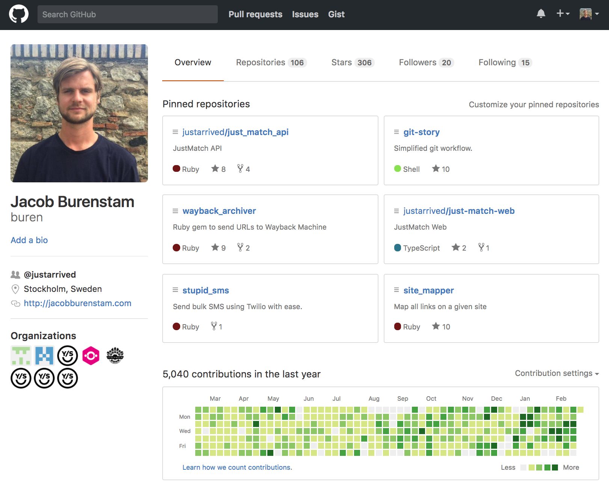

```ruby
include OpenHack

author = Presenter.new(:buren)
slides = OpenSource::Slides.new

wait until author.ready?

author.present(slides) do |slide|
  print slide
  any_questions? if slide.last?
end
```

_Goto_: http://jacobburenstam.com/openhack-open-source


---


Guide \| Empower \| Connect

---

# GOTO

## [jacobburenstam.com/openhack-open-source](http://jacobburenstam.com/openhack-open-source)

---

<div data-poller="js-poll-openhack-open-source-xp">
  <p>Open source?</p>
  <button data-answer>Open source?</button>
  <button data-answer>No</button>
  <button data-answer>Not yet..</button>
  <button data-answer>A bit</button>
  <button data-answer>A lot</button>
  <hr>
  <div data-chart data-refresh="5"></div>
</div>

---

<div data-poller="js-poll-openhack-open-source-user">
  <p>Do you use open source?</p>
  <button data-answer>Yes</button>
  <button data-answer>No</button>
  <hr>
  <div data-chart data-refresh="5"></div>
</div>

---

# Agenda

* What is open source?
* Licenses, MIT, GPL etc
* Richard Stallman :neckbeard:
* sentry.io
* Open source risks?
  - The case of hacking Instagram
  - https://exfiltrated.com/research-Instagram-RCE.php
  - AWS/Slack tokens
* How can I get started contributing?
* Why, why are all these developers giving away their code??? :scream:
  - Could open source concept be used outside of software?
  - We're already seeing an explosion of open source hardware
  - Open source banks? governments?
* Why aren't governments institutions open sourcing their code???
  - WHY?!?#!@#^!
* Modern open source
  - Google (TensorFlow, Kubernetes, Angular, ...)
  - Facebook (React, HHVM, jest, ...) and what about their patent-clause?
  - Microsoft, yes Microsoft.. (dotnet, vscode, TypeScript, ..)

---

# You use
# open source
# all the time

---

### Disclaimer

* __Personal__ opinions, __not__ the opinions of my employer.
* YMMV (Your mileage may vary)

---

## Jacob Burenstam

* Open source tinkerer
* Useless code enthusiast
* Co-Founder and CTO at Just Arrived

<hr>

* [github.com/buren](https://github.com/buren)
* [keybase.io/buren](https://keybase.io/buren)

---

# I love open source



---

# This slide deck is open source

[github.com/buren/openhack-open-source](https://github.com/buren/openhack-open-source)

---

# Just Arrived is open source :heart:

[github.com/justarrived](https://github.com/justarrived)

---

Remember the code from the first slide?

```ruby
include OpenHack

author = Presenter.new(:buren)
slides = OpenSource::Slides.new

wait until author.ready?

author.present(slides) do |slide|
  print slide
  any_questions? if slide.last?
end
```

---

```ruby
DEADLINE = Time.new(2016, 5, 18, 19, 0, 0).freeze
module OpenHack;end
module OpenHack::OpenSource;end
String.class_eval { define_method(:last?) { false } }
NilClass.class_eval { define_method(:last?) { true } }
define_method(:wait) { puts 'Still not ready..';sleep 3 }
define_method(:any_questions?) { puts 'Any questions?' }
define_method(:feedback) { puts 'Feedback?' }
class OpenHack::Presenter < Struct.new(:name)
  define_method(:ready?) { Time.now >= DEADLINE }
  def present(slides); slides.to_a.each { |slide| yield(slide) };end
end
class OpenHack::OpenSource::Slides
  define_method(:initialize) { @slides = File.read('slides.md').split('---') }
  define_method(:to_a) { @slides + [nil] }
end
```

This actually makes the previous code work :trollface:

---

* [http://git.io/vnWsf](http://git.io/vnWsf)


---

# Build something awesome

---

# Build something open source

---

## By the way we're hiring


---


Guide \| Empower \| Connect

---


---

# Questions?

## github.com/buren
## github.com/justarrived


---


<!-- Third party dependencies -->
<script src="js/libs/jquery.js"></script>
<!-- <script src="js/libs/highcharts.js"></script> -->
<script src="https://www.google.com/jsapi"></script>
<script src="js/libs/chartkick.js"></script>

<!-- JavaScript -->
<script src="js/log.js"></script>
<script src="js/resize-hack.js"></script>

<script>
  PollerConfig = { url: 'https://throwawaypoll.herokuapp.com' };
</script>
<script src="js/poller.js"></script>
<script src="js/poller-dom.js"></script>
<script>
  PollerConfig = { url: 'https://throwawaypoll.herokuapp.com' };
</script>
