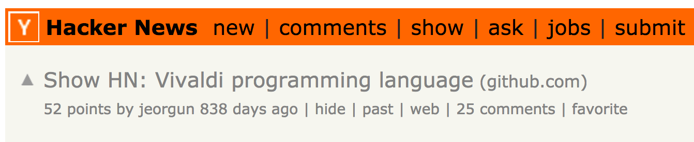
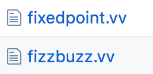
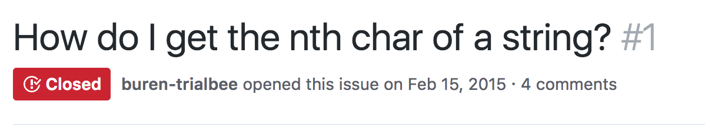
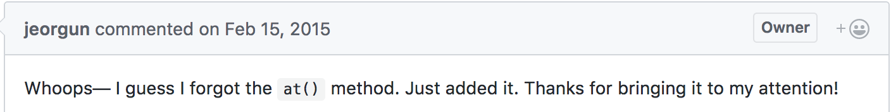
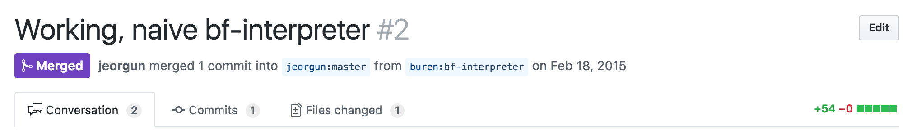
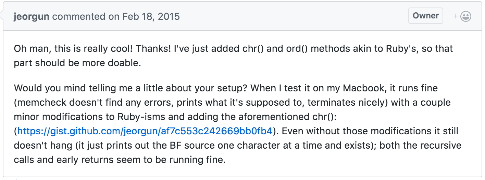

```ruby
include OpenHack

author = Presenter.new(:buren)
slides = OpenSource::Slides.new

wait until author.ready?

author.present(slides) do |slide|
  print slide
  any_questions? if slide.last?
end
```

http://jacobburenstam.com/openhack-open-source


---


Guide \| Empower \| Connect

---

### Slides

[jacobburenstam.com/openhack-open-source](http://jacobburenstam.com/openhack-open-source)

---

<div data-poller="js-poll-openhack-open-source-xp">
  <p>Have you contributed to Open source?</p>
  <button data-answer>Open source?</button>
  <button data-answer>No</button>
  <button data-answer>Not yet..</button>
  <button data-answer>A bit</button>
  <button data-answer>A lot</button>
  <hr>
  <div data-chart data-refresh="5"></div>
</div>

---

<div data-poller="js-poll-openhack-open-source-user">
  <p>Do you use open source?</p>
  <button data-answer>Yes</button>
  <button data-answer>No</button>
  <hr>
  <div data-chart data-refresh="5"></div>
</div>

---

### Disclaimer

* __Personal__ opinions, __not__ the opinions of my employer.
* __YMMV__ - Your mileage may vary)
* __IANAL__ - I'm not a lawyer

---

## Jacob Burenstam

* Open source tinkerer
* Useless code enthusiast
* Co-Founder and CTO at Just Arrived


<hr>


* [github.com/buren](https://github.com/buren)
* [keybase.io/buren](https://keybase.io/buren)

---

# I love open source


---

# This slide deck is open source

[github.com/buren/openhack-open-source](https://github.com/buren/openhack-open-source)

---

# Just Arrived is open source :heart:

[github.com/justarrived](https://github.com/justarrived)

__P.S We're hiring__

---

# @buren :heart: open source

* Active in open source for over 5 years
* Contributed to >30 OSS projects
* Open source libs/projects of my own
  - Just Arrived is by far the largest :wink:

---

## :heart: Hackathons

* Android TV, Hackathon winner @ Google
  - "Read automatic captions and use NLP to link various topics to Wikipedia, Maps, IMDB etc"
* Just Arrived got started at OpenHack!

***

### Intro

* What is open source?
* Licenses, MIT, GPL etc :books:
* Richard Stallman & Linus Torvalds :neckbeard:

---


## What is open source?

---

* ~~What is open source?~~
* Licenses, MIT, GPL etc :books:
* Richard Stallman & Linus Torvalds :neckbeard:

---

## Licenses, MIT, GPL etc :books:

---

* ~~What is open source?~~
* ~~Licenses, MIT, GPL etc :books:~~
* Richard Stallman & Linus Torvalds :neckbeard:

---

## Richard Stallman & Linus Torvalds :neckbeard:

Completely different views on open source. Even though both are considered open source "heroes".

> I didn't want code, I wanted comments. - Linus Torvalds

> If you use a proprietary program, you're defenceless. - Richard Stallman

---

* ~~What is open source?~~
* ~~Licenses, MIT, GPL etc :books:~~
* ~~Richard Stallman & Linus Torvalds :neckbeard:~~

<br>

## Questions or comments?

***

### Open Source Business

***

### Open Source Business

* Open source companies :office:
  - Sentry (sentry.io)
  - Just Arrived
  - Discourse
  - Neo4J
  - ...
* Open source risks? :lock:
  - The case of hacking Instagram
  - https://exfiltrated.com/research-Instagram-RCE.php
  - AWS/Slack tokens

---

## Open source companies :office:

- Sentry (sentry.io)
- Just Arrived
- Discourse
- Neo4J
- ...

---

* ~~Open source companies :office:~~
* Open source risks? :lock:
  - The case of hacking Instagram
  - https://exfiltrated.com/research-Instagram-RCE.php
  - AWS/Slack tokens

---


## Open source risks? :lock:

- The case of hacking Instagram
- https://exfiltrated.com/research-Instagram-RCE.php
- AWS/Slack tokens

---

* ~~Open source companies :office:~~
* ~~Open source risks? :lock:~~

<br>

## Questions or comments?

***

### Open Source Motivation :muscle:

***

### Open Source Motivation :muscle:

* Why are all these developers giving away their code? :scream:
  - Hobbyist, Hackers, Tinkerers
  - Curiosity
* Its fun and unexpected stuff happens!
  - Writing a brainfuck interpreter in a 20-day-old language
  - Archiving certain USGOV sites in response to Trump

---

## Why are all these developers giving away their code? :scream:

- Hobbyist, Hackers, Tinkerers
- Curiosity

---

## What is your motivation?

---

## Its fun and unexpected stuff happens!

---

## Two stories of my own

---

### Writing a brainfuck interpreter in a 20-day-old language.

- https://news.ycombinator.com/item?id=9053694
- https://github.com/buren/vivaldi-bf-interpreter

---

## Vivaldi - Hacker News



---
### Current examples



---

## I wonder if I can write a
## brainfuck interpreter with Vivaldi
## 🤔

---

## Vivaldi
## Github issue #1



---



---


---



---



:heart_eyes_cat:

---

## Archiving certain USGOV sites in response to Trump

Professors were scared that the Trump administration would withdraw funding for certain gov-sites.

They started mass-archiving sites to the Internet Archive.

<hr>

[github.com/buren/wayback_archiver](https://github.com/buren/wayback_archiver)

[venturebeat.com article](https://venturebeat.com/2017/05/10/the-internet-archive-has-preserved-200tb-of-government-website-data-during-transition-to-trump-administration/)

---

## Questions or comments?

***

### Big open source™

***

### Big open source™

* Modern open source
  - Google (TensorFlow, Kubernetes, Angular, ...)
  - Facebook (React, HHVM, jest, ...) and what about their patent-clause?
  - Microsoft, yes Microsoft.. (dotnet, vscode, TypeScript, ..)
* Could open source be used in new places?
  - Outside of software?
  - Open source banks? governments?
  - Why aren't governments institutions open sourcing their code???
    - WHY?!?#!@#^! :hocho:

---

## Modern open source

- Google (TensorFlow, Kubernetes, Angular, ...)
- Facebook (React, HHVM, jest, ...) and what about their patent-clause?
- Microsoft, yes Microsoft.. (dotnet, vscode, TypeScript, ..)

---

* ~~Modern open source~~
* Could open source be used in new places?
  - Outside of software?
  - Open source banks? governments?
  - Why aren't governments institutions open sourcing their code???
    - WHY?!?#!@#^! :hocho:

---

## Could open source be used in new places?

* Open source banks? governments?
* Why aren't governments institutions open sourcing their code???
  - WHY?!?#!@#^! :hocho:
* Outside of software?

---

* ~~Modern open source~~
* ~~Could open source be used in new places?~~

<hr>

## Questions or comments?

***

### Contribute to open source

***


### Contribute to open source

* How can I get started contributing?
  - Contributing to a OSS project
  - Building a OSS project

---

## How can I get started contributing?

* Contributing to a OSS project
  - Start small
  - Read some old pull requests and issues
  - Validate that your change is needed
  - Be nice :smiley:
  - Spend time on writing good issues and pull requests
* Building a OSS project
  - Build something yourselves
  - Being a maintainer can be hard
  - People are _not always_ nice

***

Remember the code from the first slide?

```ruby
include OpenHack

author = Presenter.new(:buren)
slides = OpenSource::Slides.new

wait until author.ready?

author.present(slides) do |slide|
  print slide
  any_questions? if slide.last?
end
```

---

```ruby
DEADLINE = Time.new(2017, 6, 3, 14, 30, 0).freeze
module OpenHack;end
module OpenHack::OpenSource;end
String.class_eval { define_method(:last?) { false } }
NilClass.class_eval { define_method(:last?) { true } }
define_method(:wait) { puts 'Still not ready..';sleep 3 }
define_method(:any_questions?) { puts 'Any questions?' }
define_method(:feedback) { puts 'Feedback?' }
class OpenHack::Presenter < Struct.new(:name)
  define_method(:ready?) { Time.now >= DEADLINE }
  def present(slides); slides.to_a.each { |slide| yield(slide) };end
end
class OpenHack::OpenSource::Slides
  define_method(:initialize) { @slides = File.read('slides.md').split('---') }
  define_method(:to_a) { @slides + [nil] }
end
```

This actually makes the previous code work :trollface:

---

* [http://git.io/vnWsf](http://git.io/vnWsf)


---

# Build something awesome

---

# Build something
# open source

---


Guide \| Empower \| Connect

---

# Questions?

## github.com/buren
## github.com/justarrived


_We're hiring :heart_eyes_cat:_

---


Guide \| Empower \| Connect

<!-- Third party dependencies -->
<script src="js/libs/jquery.js"></script>
<!-- <script src="js/libs/highcharts.js"></script> -->
<script src="https://www.google.com/jsapi"></script>
<script src="js/libs/chartkick.js"></script>

<!-- JavaScript -->
<script src="js/log.js"></script>
<script src="js/resize-hack.js"></script>

<script>
  PollerConfig = { url: 'https://throwawaypoll.herokuapp.com' };
</script>
<script src="js/poller.js"></script>
<script src="js/poller-dom.js"></script>
<script>
  PollerConfig = { url: 'https://throwawaypoll.herokuapp.com' };
</script>
